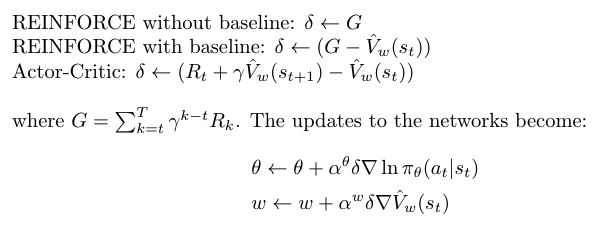
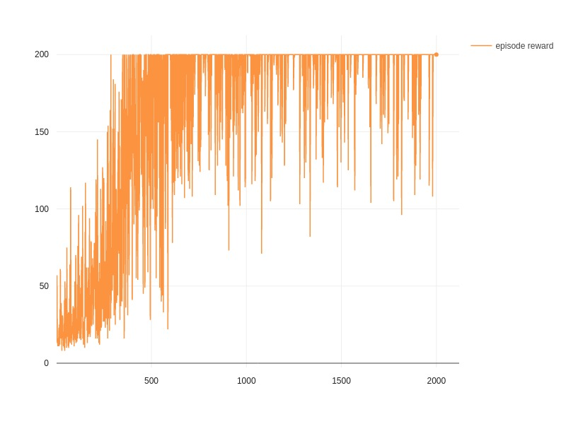
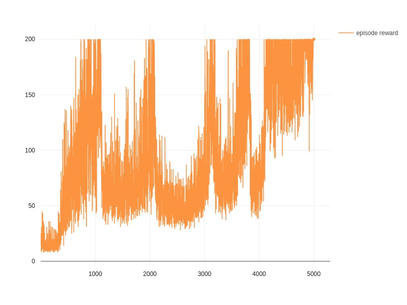
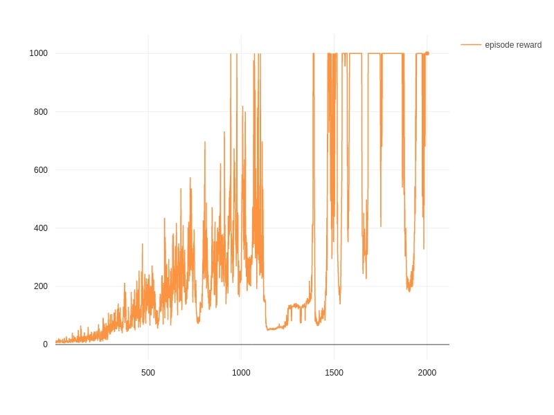

# Pytorch simple policy gradients methods                                                       
Implementation of simple policy gradient algorithms such as REINFORCE with and without a baseline and the one-step Actor-Critic method. This repo supports both **continuous** and **discrete** environments in OpenAI gym.                                                  
## Requirements                                         
    - Python 3.xx
    - Pytorch                                                                    
    - OpenAI gym                                                                                         
    - Mujoco (optional)                                                                                 

## Algorithms                                                                                          
The main difference between the two algorithms implemented are in the TD error (i use the greek letter delta below to denote this) used for updating the policy (and state-value) network. 

REINFORCE uses a Monte Carlo type error that is sometimes called "rewards-to-go" (https://spinningup.openai.com/en/latest/spinningup/rl_intro3.html#don-t-let-the-past-distract-you). Whereas the actor-critic architecture uses boostrapping based off of the value network. 



For continuous action space we use a Gaussian distribution followed by a tanh function to squeeze the actions into a fixed interval.

# How to run and Configuration

There are two folder for each of the two methods implemented in this repo (one-step Actor Critic and REINFORCE).  

An example of how to run reinforce:                     
```bash                                                                                                  
> python main_reinforce.py --namestr="CartPole Reinforce Baseline" --env-name CartPole-v0 --baseline True --action-space discrete --num-episodes 2000                         
```
An example of how to run the actor-crtic method:                     
```bash                                                  
> python main_actor_critic.py --namestr="Cartpole Actor Critic" --env-name CartPole-v0 baseline True --action-space discrete --num-episodes 5000
```

notice that there are a couple of command line arugments that can be used to customize the experiments.

    - "env-name": the name of the OpenAI gym environemt
    - "baseline": whether to use a baseline for the update or not.
    - "action-space": Whether the action space is continous or not.
    - "num_episodes": number of episode you want to run the training process for.

## Results

### Cartpole v0

Cartpole is a discrete action space environement with 2 actions (left and right). It is considered solved when the reward hits 200.

**REINFORCE with baseline**:


**One-step Actor-Critic with baseline**:


### Inverted Pendulum v1

Inverted Pendulum is a continuous action space. The environment is considered solved when the reward hits 1000.

**REINFORCE with baseline**:


One-step Actor-Critic with baseline doesn't solve the environment after 5000 episodes. 
